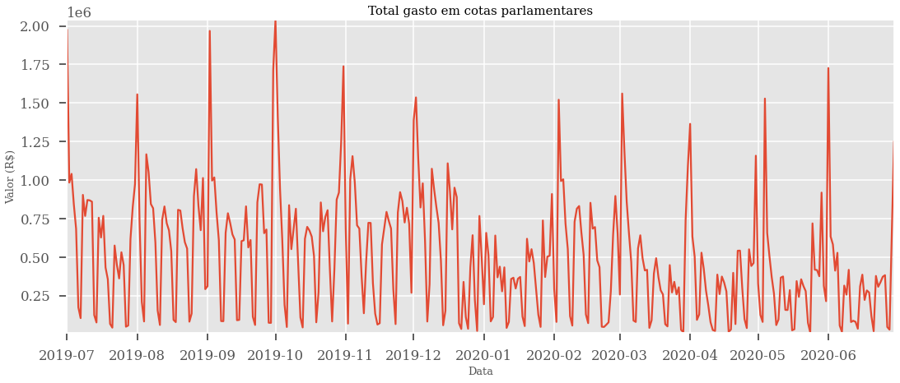
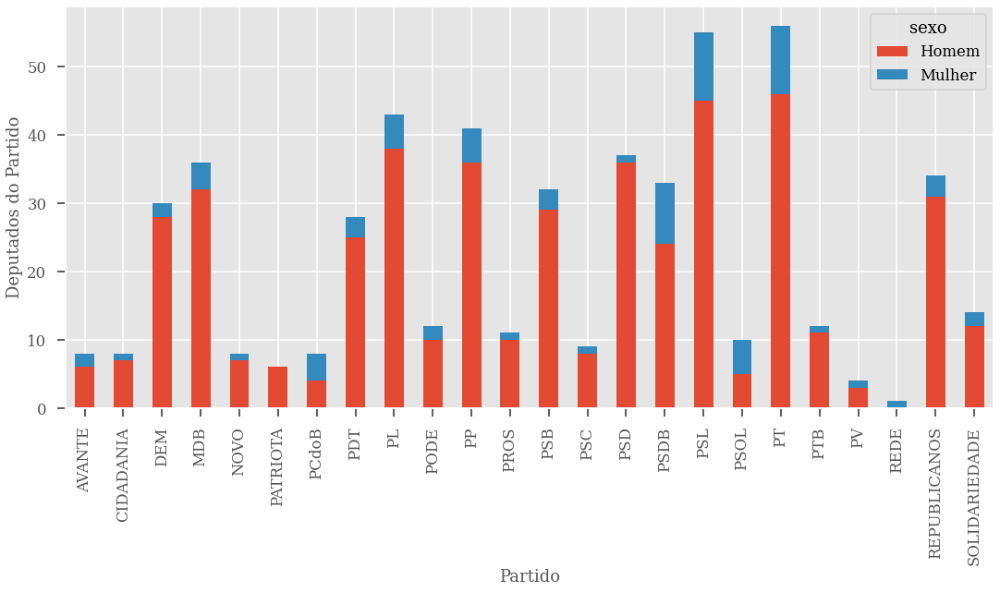
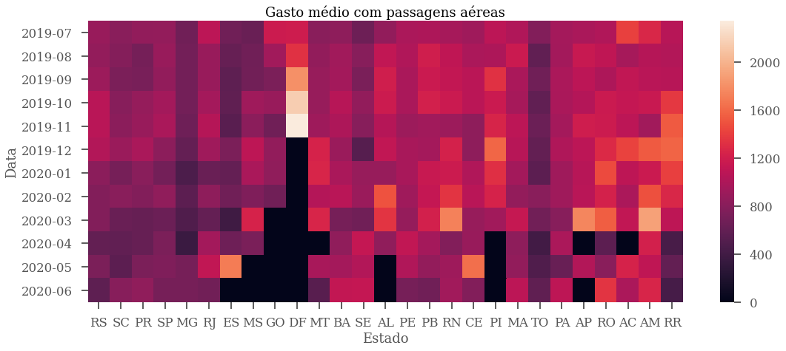

# CongressionalExpenses-BR

### About
* CongressionalExpenses-BR is a data mining tool combined with data analysis dedicated to brazilian congressional expenses. It extracts useful information from public Instagram profiles, using Selenium, to analyse patterns and trends.

### How to install the dependencies
#### Globally
* Make sure that you have python3 installed on your computer.
* Open the application folder and install the required packages in requirements.txt with the following command `pip3 install -r requirements.txt`

### How it is structured
* The folder `src/d00_apiConnection` possesses the functions that consumes the RESTful api dedicated to provide data
related to the brazilian chamber of deputies. A main function is also available.
* The folder `src/d01_cleanData` is dedicated to process raw data into a proper format for the data exploration. A main function is also available.
* The folder `src/d02_dataToModel` perform changes in the data in order to adjust it to machine learning algorithms.
* The folder `notebooks` possess one notebook related to the data exploration (`exploratory.ipynb`) and another related to the machine learning models (`model.ipynb`).

### Screenshots
* Some plots that illustrate the analysis performed with the data. More sample plots are available at the folder `sampleImages`

#### Total expenses per date

    

 

#### Distribution of gender per party

    

 

#### Mean Expense by state

    

 
